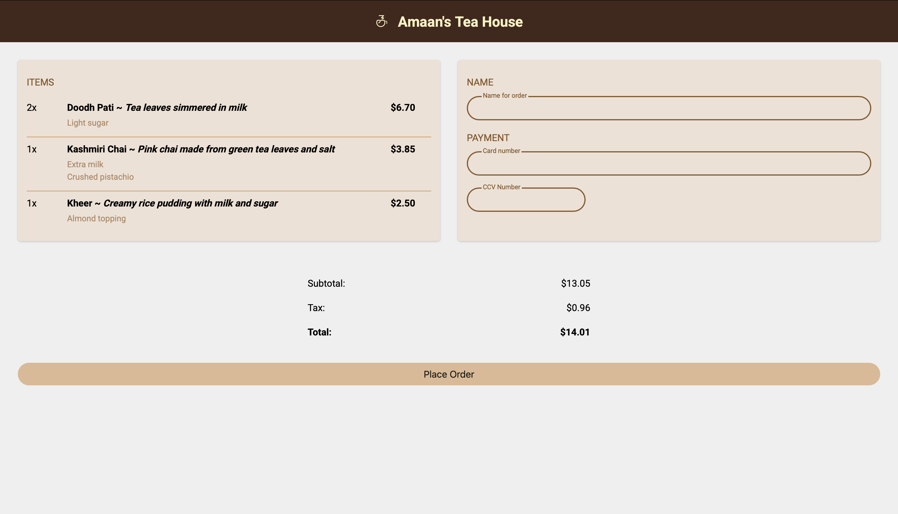

# Amaan's Tea House 🫖

Just me playing around with HTML and CSS.

- Structured a layout using CSS Grid
- Practiced styling components using the box model, shadows, and borders

## Tech Used
- HTML5
- CSS3 (Flexbox + Grid)

